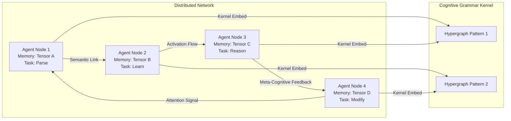
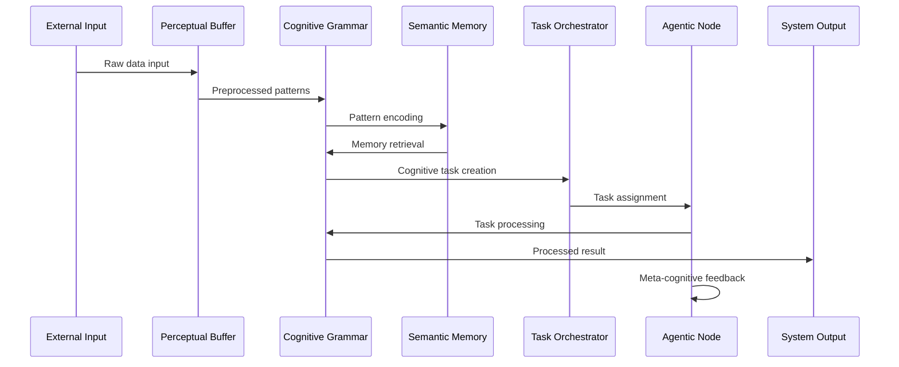
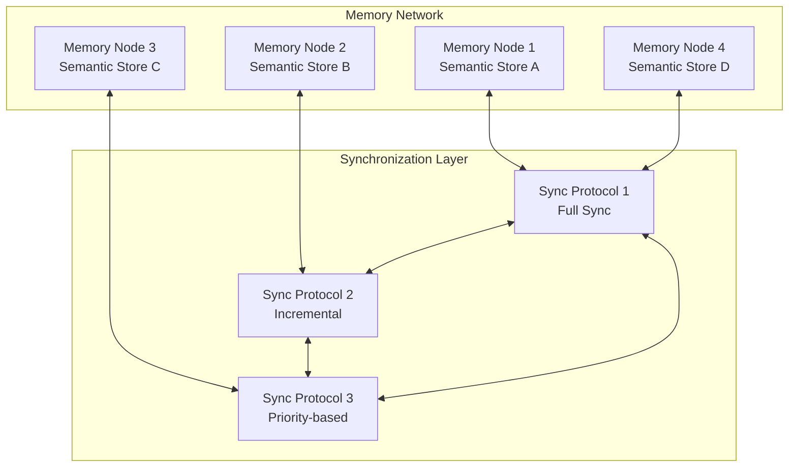

# Cognitive Grammar Architecture for torch-central

## Overview

This document describes the implementation of a distributed cognitive grammar architecture for torch-central, transforming the framework into a network of agentic cognitive nodes with hypergraph-based memory and neural-symbolic reasoning capabilities.

## Architecture Components

### 1. Core Subsystems

The cognitive architecture consists of four primary subsystems:

```mermaid
flowchart TD
    A[Repository: torch-central] --> B[Memory Subsystem<br/>(Distributed Knowledge Nodes)]
    A --> C[Task Subsystem<br/>(Agentic Orchestration Layer)]
    A --> D[AI Analytics Subsystem<br/>(Neural-Symbolic Reasoning)]
    A --> E[Autonomy Subsystem<br/>(Self-Modifying Agents)]

    B --> B1[Semantic Memory Store]
    B --> B2[Perceptual Buffer]
    C --> C1[Task Decomposition Engine]
    C --> C2[Attention Allocation Control]
    D --> D1[Symbolic Operator Engine]
    D --> D2[Tensor Field Mapper]
    E --> E1[Meta-Cognitive Self-Reflection]
    E --> E2[Adaptive Hypergraph Reconfiguration]
```

### 2. Distributed Agentic Network

Each agent operates as a hypergraph node with unique tensor dimensions and cognitive capabilities:



### 3. Cognitive Grammar Flow

The cognitive processing pipeline demonstrates how data flows through the system:



### 4. Memory Synchronization Network

Distributed memory synchronization across the cognitive network:



## Implementation Details

### Core Modules

#### 1. CognitiveGrammar.lua
The foundational cognitive grammar kernel that implements:
- Tensor-based pattern storage and manipulation
- Hypergraph node connectivity
- Symbolic operator processing
- Neural-symbolic bidirectional operations

**Key Features:**
- Configurable tensor dimensions for cognitive state
- Pattern recognition and manipulation functions
- Inter-node communication protocols
- Performance metrics and optimization

#### 2. AgenticNode.lua
Individual agentic nodes that form the distributed network:
- Task queue management and processing
- Attention allocation and focus control
- Inter-agent communication and collaboration
- Meta-cognitive self-reflection and adaptation

**Key Features:**
- Task handlers for parsing, learning, reasoning, and self-modification
- Attention pattern management (focus, distribute, gradient)
- Bidirectional agent connections
- Autonomy levels and self-modification capabilities

#### 3. MemorySubsystem.lua
Distributed memory management with semantic storage:
- Semantic memory with importance-based organization
- Perceptual buffer for preprocessing
- Memory synchronization across nodes
- Activation spreading mechanisms

**Key Features:**
- Configurable memory sizes and fragment dimensions
- Metadata tracking for access patterns and importance
- Similarity-based memory search
- Peer synchronization protocols

#### 4. TaskOrchestrator.lua
Centralized task orchestration and resource management:
- Task decomposition and planning
- ECAN-inspired attention allocation
- Resource optimization and load balancing
- Multi-agent coordination

**Key Features:**
- Multiple scheduling algorithms (priority, round-robin, cognitive)
- Dynamic resource pool management
- Agent capability matching
- Performance monitoring and optimization

## Usage Examples

### Basic Cognitive Grammar Node

```lua
-- Create a cognitive grammar node
local grammar = torch.CognitiveGrammar({
    tensorDimensions = {64, 32},
    memorySize = 512,
    nodeId = 'cg_001'
})

-- Process input pattern
local input = torch.randn(64, 32)
local result = grammar:process(input, 'activation')

-- Store pattern in memory
grammar:storeMemory(result, 1)
```

### Creating an Agentic Network

```lua
-- Create agents
local agent1 = torch.AgenticNode({
    nodeId = 'agent_001',
    nodeType = 'parser',
    autonomyLevel = 0.7,
    selfModificationEnabled = true
})

local agent2 = torch.AgenticNode({
    nodeId = 'agent_002', 
    nodeType = 'learner',
    autonomyLevel = 0.6
})

-- Connect agents
agent1:connectToAgent(agent2, 'bidirectional', 0.8)

-- Add tasks
agent1:addTask('parse', torch.randn(64, 32), 2)
agent2:addTask('learn', torch.randn(64, 32), 1)

-- Process tasks
agent1:processNextTask()
agent2:processNextTask()
```

### Memory Subsystem Usage

```lua
-- Create memory subsystem
local memory = torch.MemorySubsystem({
    semanticMemorySize = 1024,
    perceptualBufferSize = 128,
    fragmentSize = {64, 32}
})

-- Store and retrieve patterns
local pattern = torch.randn(64, 32)
local memIndex = memory:storeMemory(pattern, {importance = 1.5})
local retrieved = memory:retrieveMemory(memIndex)

-- Search similar patterns
local query = torch.randn(64, 32)
local similar = memory:searchMemory(query, 5)
```

### Task Orchestration

```lua
-- Create orchestrator
local orchestrator = torch.TaskOrchestrator({
    maxConcurrentTasks = 10,
    attentionBudget = 100.0,
    schedulingMode = 'cognitive'
})

-- Register agents
orchestrator:registerAgent(agent1, {'parse', 'reason'})
orchestrator:registerAgent(agent2, {'learn', 'modify'})

-- Create and process tasks
orchestrator:createTask('parse', torch.randn(64, 32), 2, {
    requiredCapabilities = {'parse'},
    estimatedComplexity = 1.5
})

-- Process task queue
orchestrator:processTaskQueue()
orchestrator:allocateAttention()
```

## Integration with Existing Torch7

The cognitive grammar modules are designed to integrate seamlessly with existing torch7 functionality:

- **Tensors**: All cognitive operations use standard torch tensors
- **Classes**: Built using torch.class() system for consistency
- **Memory Management**: Compatible with torch memory allocation
- **Serialization**: Can be saved/loaded using torch serialization

## Performance Considerations

### Memory Efficiency
- Configurable tensor dimensions to balance capability vs. memory usage
- Importance-based memory management with automatic cleanup
- Efficient tensor operations using torch BLAS backends

### Computational Efficiency  
- Lazy evaluation of cognitive patterns
- Attention-based resource allocation
- Parallel task processing across agents

### Scalability
- Distributed memory architecture
- Asynchronous inter-agent communication
- Hierarchical task decomposition

## Meta-Cognitive Enhancement

The architecture includes built-in meta-cognitive capabilities:

### Self-Monitoring
- Performance metric tracking across all components
- Attention allocation monitoring and optimization
- Resource usage analysis and prediction

### Self-Modification
- Adaptive behavior modification based on performance
- Dynamic attention pattern adjustment
- Automatic hyperparameter tuning

### Emergent Intelligence
- Network-level optimization through collective behavior
- Distributed problem solving across agent networks
- Recursive self-improvement through meta-cognitive feedback

## Testing and Validation

Comprehensive test suite coverage includes:

- Unit tests for individual cognitive components
- Integration tests for multi-agent scenarios
- Performance benchmarks for scalability analysis
- Correctness validation for cognitive operations

## Future Extensions

The modular architecture supports future extensions:

### Advanced Reasoning
- Integration with external symbolic reasoning engines
- Support for temporal logic and planning
- Causal reasoning and counterfactual analysis

### Learning Mechanisms
- Online learning and adaptation
- Transfer learning between agents
- Evolutionary optimization of network topology

### External Interfaces
- Integration with external knowledge bases
- API endpoints for cognitive services
- Visualization tools for network analysis

## Conclusion

This cognitive grammar architecture transforms torch-central from a static computational framework into a living, adaptive network of cognitive agents. Each component maintains the computational efficiency and scientific rigor of the original torch framework while adding sophisticated cognitive capabilities that enable emergent intelligence and autonomous operation.

The implementation demonstrates how classical tensor operations can be elevated to support distributed cognition, creating a foundation for advanced AI systems that combine the best of symbolic and neural approaches to intelligence.